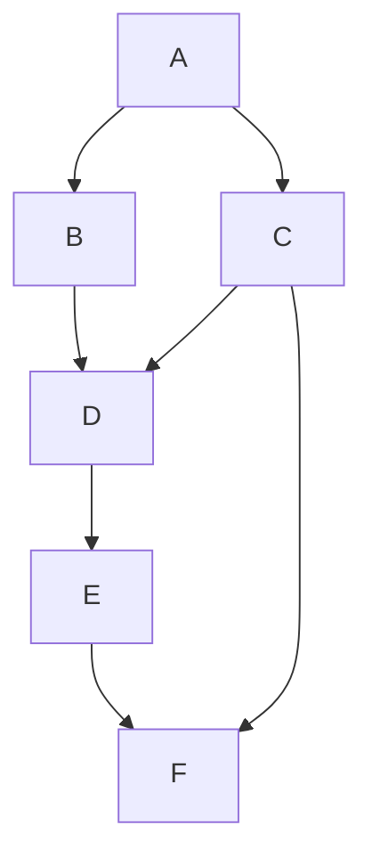

# tagd:memex Analytical Units

This document derives the user affordances and supporting system capabilities
of tagd:memex from Vannevar Bush's "As We May Think" and the accompanying
analytical-unit index cards.

This final design draft covers cards 01–21 and their supplementary units.
Source passages preserve Bush's wording. **Design Interpretation** sections
distinguish our adaptation from his historical mechanisms.

* **Capabilities** and **Behaviors** describe the intended application. They
  do
not claim that a capability already exists in the prototype.
* **Initial limitations** take precedence over broader future goals.
* **Implementation Notes** preserve agreed directions and card proposals.
* **Superseded ideas** are labeled.
* **Open Questions** remain for later UI design and software specifications.

### Central Affordance

Bush's central affordance is **selection by association** without repeatedly
starting a new index lookup. The design preserves that affordance through:

* independent record identities;
* direct endpoint navigation;
* annotations;
* reusable trail memberships; and
* reversible browsing.

Tagspace hierarchy and faceted search supplement these mechanisms.

### Adaptations

Our adaptations include:

* named branching collections;
* explicit directed association records;
* browser history; and
* modern media renderers.

Initial whole-tagspace sharing only partially realizes Bush's selective trail
reproduction.

### Index Card Images and Diagrams

The document retains relative image links for this repository layout:

* document: `design/analytical-units.md`
* source images: `design/analytical-units-index-cards/`

The photographs remain source assets and are not embedded. Spatial and
topological sketches also appear as:

* Markdown tables;
* fenced Mermaid diagrams; and
* explanatory text for viewers that do not render Mermaid.

The photographs therefore serve as optional provenance. The Markdown
reconstructions are schematic rather than pixel-precise UI specifications.

## Shared Record Model and Component Reuse

In this document, *record* is an application term for an independently
identified item that can be searched, viewed, and acted upon. The term does not
imply that every record has `tagd:memex:record` in its structural ancestry.

### Record Kinds

| Kind | Structural identity | Defining role |
| --- | --- | --- |
| Content record | Beneath `tagd:memex:record` and its specializations | Stores or refers to material presented by the memex |
| Association | Beneath `tagd:memex:association`, whose planned ancestry includes `_link` | Connects independently identified endpoints through `_from` and `_to` |
| Trail | Beneath `tagd:memex:trail` | Names a connected collection of one or more associations |
| Trail membership | Subordinate to its trail or membership container | References a canonical association without copying or reparenting it |

All these kinds remain tagd `_entity` instances with independent identities.
They can carry predicates and can be queried, viewed, and edited like other
tags.

### Component Reuse

Use the shared entity and predicate model to reuse:

* search components;
* Views;
* metadata presentation; and
* editing components.

Reuse must preserve each kind's validation, permissions, and operation
semantics. For example:

* an **association** exposes endpoints and anchors;
* a **trail** exposes membership, routes, and its trailhead; and
* a **media record** exposes supported content rendering.

A shared View abstraction requires neither a shared immediate parent nor a
single renderer. Editing must respect tagd's structural identity constraints;
it must not treat every identity field as freely mutable.

### Search Scope

Record Search must support the record kinds relevant to its task, including
associations and trails where appropriate. Restricting every search to the rank
prefix of `tagd:memex:record` would incorrectly exclude them.

Exact schema, query composition, and reusable component interfaces remain
software-specification work.

### Automatic Associations

Most associations are created deliberately through the Associate workflow
(AU 14); selecting or viewing records never creates one on its own. A few
associations are instead created **automatically**, but only as the direct
result of a single composite action whose whole purpose is to relate the two
records. The system never infers an association from records merely sharing an
incidental attribute such as `_date_added`, rank, or list adjacency.

The automatic associations tagd:memex affords are:

| Automatic association | Created by | Direction (`_from` → `_to`) |
| --- | --- | --- |
| Attachment | Adding files with a text record (AU 06) | To be specified |
| Annotation | Attaching an annotation to a record (AU 13) | Annotated record → annotation, with anchor |
| Copy provenance | Creating an editable variation from a source (AU 13) | To be specified |
| Capture note | Capturing a photo or video with a dictated note (AU 06b) | Captured media → note |
| Transcription | Transcribing a captured audio or video recording (AU 06b) | Recording → transcript |

Associations are directed; where an automatic association's direction has not
yet been decided, it remains to be specified.

Each automatic association is an ordinary, independently identified association
record that can be viewed, predicated upon, queried, and removed like any other
association (AU 14). Ordered query views, such as a **timeline** (AU 21), are not
associations and create no membership.

## Shared Navigation Principles

### Stable Addresses

Submitted searches and navigable record states use stable URLs suitable for
bookmarking and sharing.

* **Search** uses HTTP `GET`.
* **Uploads and other mutations** use HTTP `POST` where appropriate.
* **Browser Back and Forward** restore prior navigation states.

Exact state encoding remains specification work.

### Record Promotion

Loading a record through a navigation action makes it **primary** and
**active**. The previous active record remains in the secondary position or
RecordStack, according to viewport constraints.

This rule applies to:

* content records;
* association records; and
* records reached through search or trail navigation.

Background rendering and preview retrieval are not navigation actions.

### History and Context

The feed follows the active record. Browser Back restores the prior workspace,
including:

* primary and secondary record context;
* trail context; and
* reading position.

Incoming associations provide relationship-based backtracking, but they do not
replace browser history. Loading an unrelated record creates no association and
assigns no Source or Target role.

A shared URL preserves an addressable application state. It does not preserve
another user's private browser history. Exact state serialization remains a
specification task.

## 01 — View + Control: Work from a Composite Desk

### Index Card Sources

- [01 — View + Control: Work from a Composite Desk
  (front)](analytical-units-index-cards/20260916_125316.jpg)
- [01 — View + Control: Work from a Composite Desk
  (back)](analytical-units-index-cards/20260916_125327.jpg)

### Source Reference

Vannevar Bush, "As We May Think," section 6.

### Source Passage

> It consists of a desk, and while it can presumably be operated from a
> distance, it is primarily the piece of furniture at which he works.

### Bush Concept or Mechanism

A desk that integrates the memex's screens, keyboard, buttons, and levers into
the user's primary place of work.

### Design Interpretation

The Desk is the top-level composite view that arranges the views and controls
through which the user works with records.

### Component Classes

- View
- Control

### Affordance

A user can work from a composite Desk view containing the views and controls
needed to find, view, and act upon records.

### Capabilities

The Desk can compose and arrange:

- Record Search, including full-text and faceted search;
- tagspace navigation, including selectors and a tree view;
- a primary Record view;
- an associated Record view;
- Add Record and Add Association controls; and
- controls for changing which record occupies the primary view.

Detailed behavior for these contained views and controls belongs to their own
analytical units.

### Behaviors

The Desk presents its contained views and controls as one coherent workspace.

When the user loads or promotes a record, it becomes primary and active. The
former primary record remains in the secondary position or RecordStack,
according to viewport constraints. Browser history makes this move reversible.

### Implementation Notes

#### Card Proposal

The card proposes:

* tagspace navigation on the left;
* primary and associated Record Views in the main area;
* Record Search across the top;
* Add Record and Add Association controls on each Record View; and
* a composable httagd template identified as `memex/desk.html`.

#### Reviewed Layout

On wide viewports:

* search spans the top;
* tagspace navigation occupies the left; and
* search, facets, and the tagspace tree form one query-building interface.

Search and navigation can collapse on narrow viewports.

#### Active Record and Endpoint Roles

**Primary** means active; it does not mean left. When viewing an association:

* Source appears on the left and Target on the right on wide viewports;
* either endpoint can be active; and
* on narrow viewports, the active record is expanded first and the
  counterpart
is collapsed immediately below.

The reviewed role-based arrangement supersedes the card's fixed-primary-left
sketch.

#### Creation Controls

**Add Association** uses the record whose control was clicked as its initial
`_from` endpoint, including when that record is secondary. The form shows that
endpoint and permits reversal before saving.

**Standalone Add Record** creates an independent record. **Add Record** inside
the association workflow creates an endpoint and returns to the association
form. Saving the association remains explicit, and endpoint creation does not
navigate away from the form.

Exact icons, breakpoints, and template implementation remain specification
work.

#### Markdown Layout — Composite Desk

The front and back of the original card explore different search placements:

| Original sketch | Upper area | Main area | Lower area |
| --- | --- | --- | --- |
| Front | Two views | Primary on left; associated view on right | Query View spanning beneath the pair |
| Back | Title and Query View spanning the top | Navigation on left; primary and associated views beside it | Add Record at each view's lower left; Add Association at its lower right |

The promotion arrows describe the associated record becoming primary and the
former primary moving onto the RecordStack. The reviewed arrangement is:

| Desk region | Wide viewport | Narrow viewport |
| --- | --- | --- |
| Search | Across the top; text and facets | Collapsible query controls |
| Tagspace navigation | Left of record workspace | Collapsible navigation |
| Association workspace | Source left, Target right; either may be active | Active record expanded first; counterpart collapsed immediately below |
| Retained context | Previous record in secondary position or RecordStack | Previous record retained in the available counterpart position or RecordStack |
| Record actions | Add Record and Add Association on each view | Actions stay attached to the record they operate on |

The reviewed table supersedes the sketch's fixed primary-left placement and its
front-side search-below variant. Source/Target labels apply only to an actual
association.

### Design Invariants

- The Desk is a composite workspace rather than a record.
- The Desk retains the distinction between the primary record and associated
records.
- Promoting an associated record does not discard the former primary record
from the immediate working context.

### Open Questions

Bush notes the desk "can presumably be operated from a distance." Because
tagd:memex is an `httagd` web app, all storing, retrieving, and querying of
records is already reachable remotely through the web service: `tagdurls` map to
TAGL — *the language is the service* — so the record operations are inherently
network-addressable.

Bush's "operated from a distance" in modern terms suggests more than remote
record access — something closer to a remote-control experience of the Desk
itself (as with Claude's remote-control feature). That would require a
connecting service outside the scope of tagd:memex. It is recorded here as an
open issue rather than a requirement.

## 02 — View: View a Record

### Index Card Sources

- [02 — View: View a Record
  (front)](analytical-units-index-cards/20260916_125400.jpg)
- [02 — View: View a Record
  (back)](analytical-units-index-cards/20260916_125408.jpg)

### Source Reference

Vannevar Bush, "As We May Think," section 6.

### Source Passage

> On the top are slanting translucent screens, on which material can be
> projected for convenient reading.

### Bush Concept or Mechanism

Translucent screens onto which material is projected for reading.

### Design Interpretation

A View is a content region that presents a record. Views share one composable
abstraction, whether they present an individual record or form part of an
explicit composite.

### Component Classes

- View

### Affordance

A user can view a presented record.

### Capabilities

The system can:

- present an ordinary record in one View;
- present an explicitly composite record as a containing View with
  recursively
composed child Views; and
- present associated records deliberately through a containing View such as
  the
Desk, without treating association as containment.

### Behaviors

When an ordinary record is requested, its View presents that record.

When an explicitly composite record is requested, its View recursively presents
the records it contains as child Views.

Associations are not followed recursively during composite rendering. This does
not prevent the bounded, direct-association previews specified in AU 15.
Tagspace ancestry alone does not establish visual containment.

### Implementation Notes

The card proposes an httagd View template and handler that produce an HTML
partial for a requested record. It sketches a request in which the record is
the TAGL subject and a View template is selected through a query parameter.

The specific proposal recorded on the card is:

    /<record>?v=memex/view.html

with the template `memex/view.html.tpl`. The card expects a well-formed request
to return the correct HTML with HTTP status 200.

The card's proposed protocol behavior returns the requested record as an HTML
partial and recursively produces partials for records explicitly contained by a
composite record. Exact routes, parameter names, and status handling belong in
the later software specification.

### Design Invariants

- Every presented record uses the same View abstraction, with specialized
rendering and controls appropriate to its kind.
- Recursive View composition follows explicit containment only.
- An association does not imply visual containment.
- Rendering a record does not recursively traverse the association graph.

## 03 — Input: Enter Text

### Index Card Sources

- [03 — Input: Enter Text
  (front)](analytical-units-index-cards/20260916_125422.jpg)
- [03 — Input: Enter Text
  (back)](analytical-units-index-cards/20260916_125432.jpg)

### Source Reference

Vannevar Bush, "As We May Think," section 6.

### Source Passage

> There is a keyboard, and sets of buttons and levers.

### Bush Concept or Mechanism

A physical keyboard for entering text into the memex.

### Design Interpretation

A multiline text-entry control captures Unicode text for use in a record.

### Component Classes

- Input

### Affordance

A user can enter and edit multiline UTF-8 text.

### Capabilities

The system can:

- accept text from a physical or on-screen keyboard;
- preserve Unicode characters using UTF-8; and
- preserve intentional line breaks in multiline text.

### Behaviors

As the user enters or edits text, the text-entry control reflects and retains
the current value until the containing workflow is submitted or cancelled.

In a multiline text field, Enter inserts a newline. The user submits with a
visible Submit control or, on a physical keyboard, with Ctrl+Enter or
Command+Enter. Single-line inputs may use Enter to submit or confirm.

### Implementation Notes

The card proposes an HTML form with a textarea and a submission control. It
also proposes sending the submitted text through the web API using a TAGL put
command in the selected tagspace, after which the stored record is presented in
a View.

More specifically, the card proposes a web API POST callback that issues the
TAGL `put` operation. This is retained as an implementation proposal rather
than fixed here as the final route or protocol design.

Submission, record construction, persistence, and subsequent presentation are
preserved here as design inputs but belong respectively to the Add Record,
storage, and View analytical units.

### Design Invariants

- Text entry supports multiline UTF-8 content.
- Editing text does not itself create or store a record.
- Record submission is a deliberate action distinct from entering text.
- Multiline text entry preserves the conventional behavior of the Enter key.

## 03a — Input + Control: Dictate and Command by Voice

### Index Card Sources

No index card. Added during design review to capture Bush's speech-controlled
mechanisms alongside the keyboard affordance of AU 03.

### Source Reference

Vannevar Bush, "As We May Think," sections 3 and 5.

### Source Passage

> Combine these two elements, let the Vocoder run the stenotype, and the result
> is a machine which types when talked to.

> One might, for example, speak to a microphone, in the manner described in
> connection with the speech controlled typewriter, and thus make his
> selections. It would certainly beat the usual file clerk.

### Bush Concept or Mechanism

A speech-controlled typewriter — a Vocoder driving a stenotype — that types when
talked to, together with spoken selection of records.

### Design Interpretation

Voice is an alternative input modality that parallels the keyboard (AU 03) and
the buttons and levers (AU 04). On a device with a microphone it can drive three
tasks: dictating record content, composing or issuing a search or query, and
navigating.

### Component Classes

- Input
- Control

### Affordance

A user can dictate text and issue commands by voice — to create record content,
to search or query, and to navigate — where a microphone is available.

### Capabilities

The system can:

- transcribe spoken input to UTF-8 text for record creation, reusing the
  text-entry model of AU 03;
- accept spoken search terms and, where supported, spoken query construction,
  reusing the search model of AU 08;
- map spoken navigation commands to the same operations as visible controls
  (AU 04) and in-record navigation (AU 10);
- indicate when voice capture is listening and require an explicit start; and
- fall back to the keyboard and controls when no microphone is present or
  permission is denied.

### Behaviors

When the user dictates into a text field, spoken words are transcribed into the
field's current value; the user still submits deliberately, as in AU 03.

When the user dictates into search, the transcribed terms populate the query;
the search still runs only on explicit submission, as in AU 08.

When the user issues a mapped voice navigation command, the system performs the
same operation as the corresponding visible control or keyboard shortcut, as in
AU 04 and AU 10.

Voice input never bypasses the deliberate submission and activation rules of the
operations it drives.

### Implementation Notes

This is an optional, later enhancement; the keyboard and visible controls remain
the baseline (AU 03, AU 04). A browser speech-recognition capability or an
equivalent service supplies transcription; availability, language support,
accuracy, and privacy handling belong in the specification.

Require explicit user initiation and a visible listening indicator. Respect
device permissions and degrade gracefully when voice is unavailable. Command
vocabulary, start/stop affordances, and disambiguation belong in the
specification.

### Design Invariants

- Voice is an alternative modality, not the only means of any essential
  operation.
- Dictation and voice commands obey the same submission and activation rules as
  the keyboard and controls.
- Voice capture requires explicit initiation and a clear listening indicator.
- Absence of a microphone, or denial of permission, never blocks keyboard and
  control access.

## 04 — Control: Trigger an Operation

### Index Card Sources

- [04 — Control: Trigger an Operation
  (front)](analytical-units-index-cards/20260916_125444.jpg)
- [04 — Control: Trigger an Operation
  (back)](analytical-units-index-cards/20260916_125453.jpg)

### Source Reference

Vannevar Bush, "As We May Think," section 6.

### Source Passage

> There is a keyboard, and sets of buttons and levers.

### Bush Concept or Mechanism

Physical buttons and levers that cause the memex to perform operations.

### Design Interpretation

Visible interface controls and optional keyboard shortcuts allow users to
invoke tagd:memex operations deliberately.

### Component Classes

- Control

### Affordance

A user can deliberately trigger a memex operation through a visible control or
an equivalent keyboard shortcut.

### Capabilities

The system can:

- present buttons, selectors, and other controls for available operations;
- map a keyboard shortcut to an operation when appropriate;
- expose whether a control is available or unavailable; and
- invoke the same operation from mouse, touch, or keyboard activation.

### Behaviors

When the user activates a control, the system performs its associated
operation.

When the user invokes a mapped keyboard shortcut, the system performs the same
operation as the corresponding visible control.

### Implementation Notes

The card proposes HTML buttons, selectors, inputs, and related form controls.
Specific controls and their resulting operations will be defined by the
analytical units and later specifications for those operations.

### Design Invariants

- Triggering an operation is distinct from entering record content.
- Equivalent mouse, touch, and keyboard activation invokes the same
  operation.
- A keyboard shortcut is not the only means of invoking an essential
operation.
- Controls communicate their purpose and availability.

## 05 — Storage: Store Records

### Index Card Sources

- [05 — Storage: Store Records
  (front)](analytical-units-index-cards/20260916_125504.jpg)
- [05 — Storage: Store Records
  (back)](analytical-units-index-cards/20260916_125514.jpg)

### Source Reference

Vannevar Bush, "As We May Think," section 6.

### Source Passage

> In one end is the stored material.

### Bush Concept or Mechanism

An internal repository that stores the user's books, records, and other
material.

### Design Interpretation

tagd:memex stores records in a tagspace. File-backed records use Filepile: a
tagspace over a filesystem, combining semantic description with file storage.

### Component Classes

- Storage

### Affordance

A user can store records for later retrieval and use.

### Capabilities

The system can:

- store and retrieve records through their tagspace identities;
- store text-only record content directly as a TAGL object value;
- describe file-backed records with tagspace metadata and relations;
- associate a file-backed record with its stored filesystem content; and
- preserve both text-only and file-backed records within the same semantic
model.

### Behaviors

When a text-only record is stored, its content is retained in the tagspace as a
TAGL object value.

When a file-backed record is stored, Filepile stores the file in the filesystem
and retains its semantic representation in the overlaid tagspace.

Stored records can later be retrieved through the tagspace.

### Implementation Notes

The card proposes representing a file record with a `file://` URL tag that
locates the stored file and carries predicates for metadata and other
relations. It also sketches web API operations for retrieving a record by tag
identifier and storing file bytes from a request body.

The specific API sketch on the card is:

    GET /<tag-id>
    PUT /<tag-id>

where `GET` retrieves the record whose `_id` is `<tag-id>`, and `PUT` carries
the file's binary stream in the request body. The card also proposes verifying
that an uploaded file is stored and represented in the tagspace.

The exact file-addressing scheme, hashing, deduplication, API routes, and wire
formats belong in later software specifications. A future implementation may
materialize a text-only record as a file when useful, but this is not required
for initial text-record storage.

### Design Invariants

- Filepile is conceptually a tagspace over a filesystem.
- The tagspace provides the semantic representation of stored records.
- A text-only record does not require a corresponding file.
- File storage and semantic description remain distinct responsibilities even
when Filepile presents them as one system.

## 06 — Input + Control: Add a Record

### Index Card Sources

- [06 — Input + Control: Add a Record
  (front)](analytical-units-index-cards/20260916_125526.jpg)
- [06 — Input + Control: Add a Record
  (back)](analytical-units-index-cards/20260916_125535.jpg)

### Source Reference

Vannevar Bush, "As We May Think," section 6.

### Source Passage

> And there is provision for direct entry. On the top of the memex is a
> transparent platen.

### Bush Concept or Mechanism

A transparent platen through which notes, photographs, memoranda, and other
material can be entered directly into the memex.

### Design Interpretation

An Add Record form accepts text, files, or both and creates the corresponding
records and relations as one operation.

### Component Classes

- Input
- Control

### Affordance

A user can add a text record, a file record, or a text record with file
attachments.

### Capabilities

The system can:

- require a title and derive an editable candidate record identifier;
- accept multiline UTF-8 text;
- accept one or more files;
- represent each file as a separate file record;
- associate attached file records with their text record;
- validate the proposed records before storing them; and
- store all records and attachment associations as one operation.

### Behaviors

| Submitted material | Stored result |
| --- | --- |
| Text only | One text record |
| One or more files without text | One file record for each file |
| Text with files | One text record, one record per file, and attachment associations connecting them |

#### After Submission

* A successful standalone submission that creates one record presents that
record in a View.
* Add Record inside Add Association returns the created endpoint to the
association form. Saving the association remains a separate action.
* Cancelling the association form does not undo an endpoint already stored.
* Presentation after a files-only submission that creates several records
remains a UI specification question.

#### Initial Failure Behavior

There are initially no transactions. If a later step fails, earlier successful
changes can remain. Display the HTTP status and raw TAGL errors returned by the
service; failure does not imply rollback.

### Implementation Notes

The card proposes an HTML partial containing:

* a textarea;
* an Add File control;
* a Submit control; and
* selected-file thumbnails or file-type indicators above the input.

Text-only records can store content as TAGL object values. File records are
stored through Filepile. The precise attachment relator and representation
belong in the later software specification.

#### Markdown Layout — Add Record Form

Read this table from top to bottom; it captures the card's spatial proposal.

| Form region | Contents |
| --- | --- |
| Above input | Selected-file thumbnails or file-type indicators |
| Main input | Textarea for record text |
| Lower left | Add File control |
| Lower right | Submit control |

Files selected by the picker or dropped onto the supported drop area feed the
same pending-file presentation. The layout supports text, files, or both; the
reviewed submission behavior takes precedence over the card's earlier keyboard
ideas.

### Design Invariants

- Text and each attached file retain separate record identities.
- Attachments are explicit associations rather than opaque fields embedded in
a text record.
- One Add Record submission is a user operation, not an initial transaction
guarantee. Atomic creation is a future capability requiring coordination of
tagspace changes and filesystem writes.
- Adding a record does not require text to be materialized as a file.

## 06a — View: Recognize a Record's Media Type

### Index Card Sources

- [06a — View: Recognize a Record's Media Type
  (front)](analytical-units-index-cards/20260916_125550.jpg)
- [06a — View: Recognize a Record's Media Type
  (back)](analytical-units-index-cards/20260916_125558.jpg)

### Source Reference

Vannevar Bush, "As We May Think," section 6.

### Source Passage

> Books of all sorts, pictures, current periodicals, newspapers, are thus
> obtained and dropped into place.

### Bush Concept or Mechanism

The memex accepts recognizable kinds of material, including books, pictures,
periodicals, newspapers, correspondence, notes, and photographs.

### Design Interpretation

Content records belong beneath tagd:memex:record. A file-backed content record
also has one effective presentation specialization that selects a familiar icon
and an appropriate default View. Flexible semantic tags categorize the record
independently of that specialization.

### Component Classes

- View

### Affordance

A user can recognize a record's broad media type and view it through an
appropriate default presentation.

### Capabilities

The system can:

- inspect file content and MIME information;
- assign one effective presentation specialization to a file-backed record;
- map that specialization to a recognizable icon and default View;
- fall back to a generic binary presentation when no more specific supported
specialization applies;
- provide a way to report an unsupported or incorrectly handled file type;
  and
- allow any number of flexible semantic tags in addition to the presentation
specialization.

### Behaviors

When a file-backed record is added, the system determines its effective
presentation specialization and displays the corresponding icon.

When the record is viewed, the specialization selects the default renderer,
such as a PDF viewer, image viewer, audio player, or video player.

When no supported specialization can be determined, the record uses the binary
fallback, remains available for download or external handling, and offers a
link for reporting the unsupported type.

### Implementation Notes

The initial predefined specialization hierarchy is deliberately small:

- tagd:memex:record:document
- tagd:memex:record:image
- tagd:memex:record:audio
- tagd:memex:record:video
- tagd:memex:record:binary

The card's earlier sketch placed association and trail in the same list as
document, image, audio, video, and binary. The design separates those semantic
record kinds from media presentation specializations while preserving them as
possible tagspace types.

This set may grow as supported renderers are added. Familiar media icons and
presentation conventions should make the interface recognizable without turning
the specialization hierarchy into an exhaustive content ontology.

Detected MIME and content-type metadata is system-owned and is not changed by
the user. A renderer is invoked only for types it explicitly supports; other
content uses the binary fallback. Server-side validation must not rely only on
filename extensions or client-supplied MIME labels.

Semantic tags remain open-ended and may describe subject, purpose, provenance,
or any other useful facet. They do not select the default renderer.

### Design Invariants

- Each media specialization remains beneath tagd:memex:record. Other
  application
record kinds retain their own structural ancestry (Shared Record Model).
- A file-backed record has one effective presentation specialization at a
  time.
- The effective specialization selects the default View and icon.
- Binary is the safe fallback for unsupported or unrecognized content.
- Presentation specialization and semantic tagging remain orthogonal.
- User actions do not alter the system's detected MIME or content type.

### Open Questions

- Should a future power-user facility allow a presentation specialization to
be selected independently of the detected content type? The initial design does
not expose this capability; unsupported cases should instead be reported so
detection or renderer support can be corrected.

## 06b — Input + Control: Capture Photos and Video with Voice Notes

### Index Card Sources

No index card. Added during design review to capture Bush's direct, in-situ
recording using a modern device camera and microphone.

### Source Reference

Vannevar Bush, "As We May Think," sections 3 and 6.

### Source Passage

> As the scientist of the future moves about the laboratory or the field, every
> time he looks at something worthy of the record, he trips the shutter and in
> it goes, without even an audible click.

> As he moves about and observes, he photographs and comments. Time is
> automatically recorded to tie the two records together. If he goes into the
> field, he may be connected by radio to his recorder.

### Bush Concept or Mechanism

Hands-free capture of what the investigator sees, with a spoken comment, the two
records tied together automatically.

### Design Interpretation

Modern devices, especially mobile, expose the camera and microphone to web
applications. Where those devices are present and permitted, tagd:memex can
capture photos and video directly and, alongside the capture, accept a dictated
voice note — reusing the Add Record operation (AU 06), media typing (AU 06a),
and voice dictation (AU 03a).

### Component Classes

- Input
- Control

### Affordance

A user can capture a photo or video with the device camera, optionally with a
dictated voice note, and add it as a record.

### Capabilities

The system can:

- access the device camera to capture a photo or video, when present and
  permitted;
- access the microphone to capture a dictated voice note alongside the capture,
  reusing AU 03a;
- create the captured media as a file-backed record, reusing Add Record (AU 06)
  and media typing (AU 06a);
- automatically associate the captured media with its voice note (Automatic
  Associations — capture note);
- transcribe a captured audio or video recording and automatically associate the
  recording with its transcript (Automatic Associations — transcription); and
- fall back to file selection (AU 06, AU 07) when no camera or microphone is
  present or permission is denied.

### Behaviors

When the user captures a photo or video, the captured media is added as a
file-backed record through the Add Record operation (AU 06), with its
presentation specialization determined as in AU 06a.

When the user also dictates a note with the capture, the note is stored — as
text through AU 03a, or as an audio record — and is **automatically associated**
with the captured media as one operation. The captured media is the `_from`
endpoint and the note is the `_to` endpoint, following the anchored-endpoint
direction of AU 13.

When an audio or video recording is captured, an optional transcript is produced
and automatically associated with the recording, the recording being `_from` and
the transcript `_to`.

Capturing selects or produces pending media; deliberate submission stores it,
consistent with AU 06 and AU 07. A streamlined capture-and-store flow is a
possible later enhancement.

### Implementation Notes

Device access uses the browser media-capture capabilities (camera and
microphone); availability, permission prompts, formats, resolution, and privacy
handling belong in the specification. This is an optional enhancement; file
selection (AU 06, AU 07) remains the baseline when capture devices are absent.

The captured-note and transcription associations follow the shared Automatic
Associations rule: they are created only by this composite capture action, never
inferred from incidental metadata.

### Design Invariants

- Captured media are ordinary file-backed records (AU 06) with their media
  specialization (AU 06a).
- A captured note is automatically associated with its media as one operation,
  as an ordinary association record.
- Capture requires device availability and permission; its absence never blocks
  file selection.
- Capturing does not bypass the deliberate Add Record submission that stores the
  records.

## 07 — Input: Select Files by Drag and Drop

### Index Card Sources

- [07 — Input: Select Files by Drag and Drop
  (front)](analytical-units-index-cards/20260916_125852.jpg)
- [07 — Input: Select Files by Drag and Drop
  (back)](analytical-units-index-cards/20260916_125907.jpg)

### Source Reference

Vannevar Bush, "As We May Think," section 6.

### Source Passage

> Books of all sorts, pictures, current periodicals, newspapers, are thus
> obtained and dropped into place.

### Bush Concept or Mechanism

Prepared microfilm material is physically inserted into the memex. The modern
drag-and-drop gesture is our interpretation, not a gesture specified by Bush.

### Design Interpretation

Dragging files onto the Add Record form is an alternative way to select the
same files that can be selected through the file picker.

### Component Classes

- Input

### Affordance

A user can select files for a record by dragging and dropping them onto a
defined drop target.

### Capabilities

The system can:

- identify a visible drop target within the Add Record form;
- indicate when dragged files are over the valid target;
- add dropped files to the same selection used by Browse for File;
- represent selected files with thumbnails or media-type icons; and
- support file-picker selection for users who do not use drag and drop.

### Behaviors

When files are dragged over the valid drop target, the target provides clear
visual feedback.

When files are dropped on the target, they are added to the Add Record form's
current file selection and represented using the same preview list as files
chosen through the file picker.

Dropping files outside the defined target does not add them and does not cause
the browser to navigate away from tagd:memex.

Selecting files does not store them. Storage occurs only when the user submits
the Add Record form.

### Implementation Notes

The card describes dropping an existing file from the user's file browser onto
the record-input form and showing a thumbnail above the input. The preview must
also work for blank text by using a suitable file-type icon when no visual
thumbnail can be generated.

Drag-and-drop and file-picker selection feed the same underlying file-selection
state and subsequent Add Record operation defined by AU 06.

### Design Invariants

- Drag-and-drop and Browse for File are equivalent file-selection methods.
- Drag-and-drop is not required to access the file-selection capability.
- A drop selects files but does not store them automatically.
- The browser remains on the current tagd:memex interface after an invalid or
out-of-target drop.


## 08 — Input + Control: Search for Records

### Index Card Sources

- [08 — Input + Control: Search for Records
  (front)](analytical-units-index-cards/20260916_125921.jpg)
- [08 — Input + Control: Search for Records
  (back)](analytical-units-index-cards/20260916_125931.jpg)
- [08 — Input + Control: Search for Records (search
  addendum)](analytical-units-index-cards/20260916_125954.jpg)

### Source Reference

Vannevar Bush, "As We May Think," section 6.

### Source Passage

> There is, of course, provision for consultation of the record by the usual scheme of indexing.

### Bush Concept or Mechanism

Keyboard codes retrieve indexed records.

### Design Interpretation

Unified Record Search combines text, identity facets, relationship facets, and
tagspace browsing.

### Component Classes

- Input
- Control

### Affordance

A user can locate records by entering search terms, refining facets, and
browsing related tags.

### Capabilities

- Combine optional full-text terms with facets grouped in user-facing
  language, such as “What is it?” and “How is it related?”
- Browse the tagspace to select facet tags without a forced wizard sequence.
- Translate selections into TAGL without requiring knowledge of its grammar.
- Offer direct TAGL entry as an advanced option.
- Submit and revisit a complete query through a stable URL.

### Behaviors

* Search runs when the user explicitly selects Search or presses Enter in the
search input.
* Editing a query does not initially execute it.
* Each submitted search records browser history.
* Browser Back restores the preceding search state.

The form is a **`tagdurl` query builder**: `tagdurls` map to TAGL—“the language is
the service.” Bookmarking or sharing the URL preserves the query, not a frozen
snapshot of its results.

### Implementation Notes

#### HTTP and History

Search requests use HTTP `GET`. File uploads and other operations that require
`POST` retain that method. History records submitted navigations rather than
every keystroke.

#### Query Structure

The cards describe:

* zero or one subject; and
* zero or more predicates, each containing:
* a relator; * an object; and * an optional modifier or quantifier.

Facets and tagspace browsing select tag-valued query parts. The UI must
preserve that expressiveness. Precise URL encoding and an advanced-query editor
belong in the specification.

The image marked **8+** is a search addendum supporting this unit.

#### Markdown Layout — Query Builder

| Query area | User-facing purpose | Query structure represented |
| --- | --- | --- |
| Full-text input | Enter search text | Text search criteria |
| “What is it?” facets | Identify the subject or type sought | Zero or one subject, with applicable constraints |
| “How is it related?” facets | Constrain relationships | Zero or more predicates: relator, object, optional modifier or quantifier |
| Tagspace browser | Select tag-valued query parts | The same query state as the form |
| Search control | Submit explicitly | Construct and navigate to the query's tagdurl |

This represents the card's grouped controls, not a finalized grammar-to-widget
mapping. Immediate result updates remain an open future option.

### Design Invariants

- Query grammar does not become a prerequisite for ordinary search.
- Submitted query state is recoverable from its URL and browser history.
- Search is read-only; submitting it does not change stored records.

### Open Questions

Should facet changes optionally update results immediately to support
exploratory narrowing? The initial behavior is explicit submission. Text
suggestions and full result execution are separate choices.

## 08a — View: Present Search Results

### Index Card Sources

- [08a — View: Present Search Results
  (front)](analytical-units-index-cards/20260916_130017.jpg)
- [08a — View: Present Search Results
  (back)](analytical-units-index-cards/20260916_130028.jpg)

### Source Reference

Vannevar Bush, "As We May Think," section 6.

### Source Passage

> If the user wishes to consult a certain book, he taps its code on the keyboard, and the title page of the book promptly appears before him, projected onto one of his viewing positions.

### Bush Concept or Mechanism

An indexed selection makes the requested material visible.

### Design Interpretation

A search-results View presents recognizable candidate records and lets the user
choose one.

### Component Classes

- View

### Affordance

A user can recognize matching records and open the intended record.

### Capabilities

- Display title, tag ID, specialization or detected media type, and a
  relevant snippet when available.
- Use a MIME-based icon by default and thumbnails where they aid recognition.
- Emphasize matching terms in snippets.
- Present exact matches and high-confidence recommendations in a distinct
  header region, with different labels.
- Rank remaining results by relevance to the complete query, using tag rank
  as a ranking signal and deterministic tie-breaker.
- Show media-type facets represented among the results.

### Behaviors

#### Opening Results

Opening a result:

* makes the record primary and active;
* retains the previous active record in the secondary position or
  RecordStack;
* preserves normal browser actions, including opening in a new tab; and
* supersedes the earlier proposal to load it only into the initiating View.

Selecting a record as form data, such as an association endpoint, remains
distinct from opening it for navigation.

For trail results, the default trail-navigation action follows AU 19 and loads
the entry record in trail context.

#### Filtering and Paging

Selecting a media-type facet adds a query filter and follows AU 08's initial
explicit-submission behavior. AU 08b defines navigation across result pages.

### Implementation Notes

#### Result Header

The header region contains:

* exact ID matches;
* exact context-resolved referent matches; and
* clearly labeled recommendations.

A recommendation is never labeled as an exact match.

#### Ordering and Preview

The reviewed design replaces the card's rank-only ordering with relevance to
the complete query. Rank remains a signal and deterministic tie-breaker.
Surrounding-content snippets and optional thumbnails remain. Detailed scoring
belongs in the specification.

#### Markdown Layout — Search Results

| Position | Presentation |
| --- | --- |
| Results header | Exact ID/context-resolved referent matches, distinguished from labeled recommendations |
| Each result | Record identity, type icon or optional thumbnail, surrounding-content snippet with matching terms emphasized |
| Result navigation | Paging controls and recoverable query/page state |

The card's media-grouping and rank-order ideas are source proposals; they do
not supersede the reviewed relevance ordering or the distinction between exact
matches and recommendations.

### Design Invariants

- Exact matches and recommendations are distinguishable.
- Result presentation does not change detected media type or renderer
  selection.
- Opening a result follows the shared promotion/history behavior and
  preserves standard link actions.

## 08b — View + Control: Navigate Search Result Pages

### Index Card Sources

- [08b — View + Control: Navigate Search Result Pages
  (front)](analytical-units-index-cards/20260916_130046.jpg)
- [08b — View + Control: Navigate Search Result Pages
  (back)](analytical-units-index-cards/20260916_130054.jpg)

### Source Reference

Vannevar Bush, "As We May Think," section 6.

### Source Passage

> There is, of course, provision for consultation of the record by the usual scheme of indexing.

### Bush Concept or Mechanism

The memex makes indexed material available for consultation.

### Design Interpretation

Results exceeding one page remain navigable through explicit controls.

### Component Classes

- View
- Control

### Affordance

A user can move through a large result set while retaining orientation and
returning to a prior position.

### Capabilities

- Provide numbered pages with Previous and Next controls as the baseline.
- Give result pages stable GET URLs retaining the query.
- Support Load more as a progressive enhancement.
- Restore result position and navigation state through browser history.

### Behaviors

Numbered navigation replaces the displayed results page. Load more appends
another batch when that enhancement is available. Both preserve query context
and maintain URL/history state sufficient to return to the preceding result
position.

Automatic infinite scrolling is not the initial design. Availability of the
enhancement is based on capabilities and layout needs, not user-agent sniffing.

### Implementation Notes

The cards propose 20 results by default with 20/50/100 choices; retain these as
initial specification candidates. They also propose user-agent-dependent
continuous scrolling; explicit Load more supersedes that proposal.

The specification must define how appended batches and scroll position are
reconstructed on history restoration and direct URL entry.

### Design Invariants

- Numbered pagination remains a dependable baseline.
- Navigation preserves the full query.
- Progressive loading does not make browser Back lose the user's result
  position.

## 09 — Input + Control: Retrieve Familiar Records

### Index Card Sources

- [09 — Input + Control: Retrieve Familiar Records
  (front)](analytical-units-index-cards/20260916_130108.jpg)
- [09 — Input + Control: Retrieve Familiar Records
  (back)](analytical-units-index-cards/20260916_130122.jpg)

### Source Reference

Vannevar Bush, "As We May Think," section 6.

### Source Passage

> Frequently-used codes are mnemonic, so that he seldom consults his code book; but when he does, a single tap of a key projects it for his use.

### Bush Concept or Mechanism

Mnemonic codes provide quick access to familiar material.

### Design Interpretation

TAGL referents supply mnemonic access; personal recent/frequent suggestions
reduce repeated searching.

### Component Classes

- Input
- Control

### Affordance

A user can quickly retrieve familiar records using referents or personal access
history.

### Capabilities

- Search TAGL referents as well as tag IDs.
- Resolve exact referents in the applicable context.
- Show a short per-user list combining recency and frequency when an empty
  search field receives focus.

### Behaviors

The empty focused field shows a clearly labeled “Recent and frequent records”
list. Typing removes that list; query-based suggestions may replace it without
executing the full search.

An exact referent match resolved in context appears in AU 08a's exact-match
header. Other matches remain ordinary search results. Personal history does not
alter another user's results.

### Implementation Notes

Reuse TAGL referents rather than adding a separate mnemonic-code system. The
original browser-like dropdown is a presentation reference. Recency/frequency
weighting, list limits, and suggestion mechanics belong in the specification.

Bush's **code book** — a separate register of mnemonic codes the user consults
to recall an item — is superseded. Tagged records, TAGL referents, and faceted
search together provide superior recall without a parallel code registry, so no
code book is reproduced.

### Design Invariants

- Referent context participates in exact-match determination.
- Personal suggestions and submitted results remain distinguishable.
- Suggestions do not bypass explicit search submission.

## 10 — Control: Navigate Within a Record

### Index Card Sources

- [10 — Control: Navigate Within a Record
  (front)](analytical-units-index-cards/20260916_130139.jpg)
- [10 — Control: Navigate Within a Record
  (back)](analytical-units-index-cards/20260916_130150.jpg)

### Source Reference

Vannevar Bush, "As We May Think," section 6.

### Source Passage

> On deflecting one of these levers to the right he runs through the book before him, each page in turn being projected at a speed which just allows a recognizing glance at each.

### Bush Concept or Mechanism

Supplemental levers step forward or backward through pages, including larger
steps.

### Design Interpretation

Use familiar scrolling, page controls, and hotkeys appropriate to the record's
renderer.

### Component Classes

- Control

### Affordance

A user can move through a multipage or flowing record in the active View.

### Capabilities

- Support keyboard, pointer, and touch navigation appropriate to the content.
- Indicate position through standard scroll or page controls.
- Route record-navigation commands to the focused active View.
- Preserve editing and embedded-control keyboard behavior.

### Behaviors

Arrow keys and Page Up/Page Down follow the focused renderer's standard
behavior. Intrinsically paged formats may step by page; flowing content may
scroll by a viewport-sized amount.

Record shortcuts do not capture input owned by a text field, text area, editor,
or other control. Activating the surrounding View does not override a focused
control's own commands.

### Implementation Notes

Bush's levers are historical source mechanisms, not controls to reproduce. The
cards mention a right-side scrollbar and standard Home, arrow, and page keys.
Exact bindings remain subject to renderer and platform conventions.

Bush's variable-speed lever — running through pages at a recognizing glance,
then ten and then a hundred at a time — is superseded by standard modern
controls. Scrollbars, `Page Up`/`Page Down`, and arrow keys, together with the
platform key-repeat rate held down, afford the same continuous and stepped
review Bush intended, without a bespoke speed control.

Tagspace navigation also has controls mapped to hotkeys. Keep movement within a
record, movement through tagspace, and browser Back/Forward history distinct.

### Design Invariants

- Navigation acts on the intended View.
- Record shortcuts do not interfere with editing.
- Standard browser history behavior remains available.

## 11 — Control: Go to the Beginning of a Record

### Index Card Sources

- [11 — Control: Go to the Beginning of a Record
  (card)](analytical-units-index-cards/20260916_130203.jpg)

### Source Reference

Vannevar Bush, "As We May Think," section 6.

### Source Passage

> A special button transfers him immediately to the first page of the index.

### Bush Concept or Mechanism

A dedicated button returns to the beginning of the index.

### Design Interpretation

Adapt the direct-return mechanism to the beginning of the current record. This
broadening beyond Bush's index is a design interpretation.

### Component Classes

- Control

### Affordance

A user can return directly to the beginning of the active record.

### Capabilities

Provide a Go to beginning control and a suitable keyboard action for the active
renderer.

### Behaviors

The action moves the active record to its beginning without loading a different
record. It respects the keyboard ownership rules in AU 10.

### Implementation Notes

The card proposes a Go to beginning icon/button and Home. Preserve that
proposal while respecting renderer/platform conventions: Home may mean line
start in editable text and must not be globally intercepted.

### Design Invariants

- The action stays within the current record.
- Editable controls retain their normal Home behavior.

## 12 — View + Control: Work with Source and Target Views

### Index Card Sources

- [12 — View + Control: Work with Source and Target Views
  (front)](analytical-units-index-cards/20260916_130222.jpg)
- [12 — View + Control: Work with Source and Target Views
  (back)](analytical-units-index-cards/20260916_130232.jpg)

### Source Reference

Vannevar Bush, "As We May Think," section 6.

### Source Passage

> As he has several projection positions, he can leave one item in position while he calls up another.

### Bush Concept or Mechanism

Multiple projection positions keep one item available while another is
consulted.

### Design Interpretation

A responsive association workspace maintains source/target context and one
active View.

### Component Classes

- View
- Control

### Affordance

A user can inspect and act on related records while keeping their relationship
visible.

### Capabilities

- Show source and target Views side by side when space permits.
- On constrained viewports, expand the active View and retain the counterpart
  as a collapsed View below it.
- Distinguish expanded/collapsed presentation, loaded/empty content, and
  active command destination.
- Indicate the active View with a contrasting border plus a visible non-color
  cue and accessible state.
- Provide contextual Load Record controls.

### Behaviors

#### Promotion on Narrow Viewports

Activating a collapsed counterpart:

1. promotes it to the first position;
2. expands it; and
3. collapses the former active View immediately beneath it.

Association roles do not change during promotion.

#### Wide Viewports

Larger layouts can keep both Views expanded, with Source on the left and Target
on the right. Only one View receives active commands. Labels and arrows
preserve association direction independently of focus and layout.

#### Focus

Activating a Record View focuses it for navigation. Opening an input task—such
as Load Record, Record Search, or Add Record—focuses its contextual default
input. Activation or expansion alone does not focus an input.

#### Loading Records

* An empty View presents a prominent Load Record control.
* A loaded active View provides a Load Record action that opens search.
* Opening a result follows the shared promotion behavior.
* The association and trail feed updates to the newly active record.

### Implementation Notes

#### Card Controls

The cards place:

* a centered Load Record button in an empty View; and
* a Load Record icon on the lower border of a loaded View.

Both open a Record Search popover. The active state requires a visible
non-color cue; a highlighted border alone is insufficient.

AU 01 defines the Desk arrangement and contextual creation controls.

#### Association Workspace

On narrow viewports, the active record begins beneath the application header.
Its title, metadata, content, and controls flow downward. The collapsed
counterpart shows its role, identity, and association controls.

Enclose the pair visually so that the counterpart remains distinct from the
association and trail feed beneath it.

#### Direction and Active State

Use:

* persistent Source and Target labels;
* arrows showing actual association direction;
* relationship text, such as **cites** or **linked from**;
* stable, theme-compatible endpoint-role accents; and
* a separate focus treatment for the active View.

Color reinforces labels and arrows; it never carries meaning alone. A
reciprocal-arrow indicator requires actual opposing associations. Navigating a
directed association backward does not make it reciprocal.

These decisions were confirmed against
`HyperCard-RecordStack-Multiple-Views-Associations-conclusion.md`. Exact icons,
colors, breakpoints, and RecordStack mechanics remain specification work.
Source/Target role, expansion, and active state are separate concepts.

#### Markdown Layout — Paired Views and Their States

| State | Source | Target | Active/primary |
| --- | --- | --- | --- |
| Wide, Source active | Left, expanded | Right, expanded | Source |
| Wide, Target active | Left, expanded | Right, expanded | Target |
| Narrow, Source active | First, expanded | Immediately below, collapsed | Source |
| Narrow, Target active | Immediately below, collapsed | First, expanded | Target |

Within an expanded view, title and metadata precede content and controls. A
collapsed counterpart retains its role, identity, and association controls. The
pair has a visible boundary; the association/trail feed follows outside it.

| Visual element | Meaning |
| --- | --- |
| Persistent Source/Target label | Endpoint role |
| Direction arrow and relationship text | Actual association direction and meaning |
| Stable role accent | Reinforces the endpoint label; exact colors are undecided |
| Separate active treatment | Which view is primary; includes a non-color cue |
| Centered Load Record button | Empty view's load action |
| Lower-border Load Record icon | Loaded view's load action |

Selecting Load Record opens the search popover. This table preserves the card's
locations without fixing icon artwork or theme colors.

### Design Invariants

- Active state is not conveyed by color alone.
- Source/target direction is not inferred solely from left/right position.
- Contextual input focus follows an intentional input task, not ordinary
  reading.

## 13 — Input + View: Annotate a Record

### Index Card Sources

- [13 — Input + View: Annotate a Record
  (front)](analytical-units-index-cards/20260916_130246.jpg)
- [13 — Input + View: Annotate a Record
  (back)](analytical-units-index-cards/20260916_130257.jpg)

### Source Reference

Vannevar Bush, "As We May Think," section 6.

### Source Passage

> He can add marginal notes and comments, taking advantage of one possible type of dry photography, and it could even be arranged so that he can do this by a stylus scheme, such as is now employed in the telautograph seen in railroad waiting rooms, just as though he had the physical page before him.

### Bush Concept or Mechanism

Notes and comments can be added to consulted material.

### Design Interpretation

Annotation content is an independent record connected to the annotated record
by an association carrying placement metadata.

### Component Classes

- Input
- View

### Affordance

A user can add and view comments attached to a record or to a specific portion
of its content.

### Capabilities

- Create annotation content as a record or select existing content.
- Associate it with a record and, where supported, anchor it to text, a
  page/image region, a media time range, or a frame region at a time.
- Display inline or marginal annotations when supported by the renderer and
  viewport.
- Expose the association at record level when its anchor cannot be
  interpreted.

### Behaviors

In the reviewed video example, the video is `_from` and the Markdown annotation
is `_to`; the association's time/frame anchor explicitly designates `_from`.
Direction or media type alone never determines the anchored endpoint.

Reusing an annotation shares the same content record. An independently editable
variation is a new record, optionally copied from a template or existing
annotation with provenance to its source.

Constrained layouts and renderers without anchor support still make the
annotation available as an ordinary associated record.

### Implementation Notes

Annotation records retain their own structural identities beneath their record
types. Associations retain independent identities beneath
tagd:memex:association; they are not subordinate to the annotated record. See
AU 14 for the shared `_link`/`POS_LINK` implementation direction and endpoint
queries.

The association stores placement-specific anchors and their endpoint
designation. The annotation stores content. The exact encoding of text ranges,
coordinates, times, and endpoint-qualified anchors remains a specification
task.

The cards preserve inline text annotations, marginal comments at line
boundaries, image regions, and video regions over time. Rich rendering can
degrade to ordinary association presentation.

The earlier proposals to store associations or locally owned annotations
beneath the primary record were superseded during review.

### Design Invariants

- Association metadata and annotation content have separate identities.
- Anchors explicitly identify their endpoint.
- Unsupported anchor presentation does not hide the annotation.
- Editing a copy does not alter its source; editing shared content affects
  its uses.

### Open Questions

How should anchors be validated or repaired when endpoint content changes?
Until specified, do not assume anchors remain valid after edits. Exact anchor
syntax and supported initial anchor formats remain to be specified.

## 14 — View + Control: Associate Two Records

### Index Card Sources

- [14 — View + Control: Associate Two Records
  (front)](analytical-units-index-cards/20260916_130318.jpg)
- [14 — View + Control: Associate Two Records
  (back)](analytical-units-index-cards/20260916_130328.jpg)

### Source Reference

Vannevar Bush, "As We May Think," section 7.

### Source Passage

> The process of tying two items together is the important thing.

### Bush Concept or Mechanism

Associative indexing joins items so one can select another.

### Design Interpretation

A directed association is an independently identifiable record whose endpoints
may occupy different tagspace subtrees.

### Component Classes

- View
- Control

### Affordance

A user can connect two records with a named, directed association and inspect
its direction before saving.

### Capabilities

- Select the other record through Record Search.
- Present both endpoint records and explicit direction controls.
- Accept an association title and show an editable proposed unique ID.
- Reverse direction while preserving anchors on their original endpoint
  records.
- Persist the association through explicit submission.

### Behaviors

The record whose Add Association control was clicked supplies the initial
source, whether primary or secondary. The Associate action opens record
selection; selecting the counterpart presents the association form with both
endpoints. Arrows and labels show the pending direction.

Reversing direction swaps `_from` and `_to` and updates each anchor's endpoint
designation so that it still refers to the same record. A timestamp anchored to
a video remains attached to that video after reversal.

The user reviews the title, proposed ID, direction, and any anchors, then
submits Associate to store the association.

### Implementation Notes

#### Association Identity

Introduce `_link` and `POS_LINK`, with `tagd:memex:association` defined beneath
`_link`. Associations remain `_entity` instances and share general predicate,
search, View, and editing capabilities with other tags, subject to association
constraints.

Each association retains an independent structural identity beneath its
association type. It can be predicated upon, queried, and extended like other
records.

#### Endpoint Retrieval

`_from` and `_to` identify endpoint records elsewhere in the tagspace.

* Retrieve outgoing associations through the association hierarchy with an
`_from` constraint.
* Retrieve incoming associations with an `_to` constraint.
* Use endpoint indexes where appropriate.
* Resolve endpoint content separately and potentially in batches.

Rank-prefix selection narrows the association hierarchy. It does not retrieve
associations from an endpoint's subtree. Immediate discovery requires no
recursive graph traversal.

#### Core Changes

The earlier proposal to permit `POS_LINK` beneath arbitrary `POS_TAG` endpoint
records is no longer required. Grammar, construction, validation, and
persistence changes for `_link` remain specification work.

#### Card Controls

The cards specify:

* an Associate icon along the View's lower border;
* a Record Search popover;
* a counterpart display;
* reversible arrows;
* a title field;
* an editable proposed ID; and
* an explicit Associate button.

Record names containing colons do not establish rank placement. This unit
concerns individual associations; trail names and membership remain separate
from association titles. See the shared Trail Model and AUs 16–19.

#### Markdown Layout — Association Form

| Position or step | Contents or action |
| --- | --- |
| Initiating record's lower border | Associate control opens counterpart search |
| Endpoint area | Source record → Target record, with explicit endpoint labels |
| Direction control between endpoints | Reverse `_from` and `_to`; anchors remain attached to their records |
| Naming fields | Association title, followed by an editable proposed ID |
| Bottom action | Associate: explicitly save the association |

The two endpoint views follow AU 12's responsive arrangement. The arrow denotes
the association being authored; reversing it is distinct from browsing an
existing association backward.

### Design Invariants

- Association identity is independent of endpoint identity.
- Endpoint predicates, not colon-delimited names, establish the relationship.
- Reversing direction never transfers an anchor to a different record.
- Selecting endpoints does not itself store an association.

## 14a — View: Read and Review Error Messages

### Index Card Sources

- [14a — View: Read and Review Error Messages
  (front)](analytical-units-index-cards/20260916_130717.jpg)
- [14a — View: Read and Review Error Messages
  (back)](analytical-units-index-cards/20260916_130729.jpg)

### Source Reference

Supplementary design card 14a; no direct essay passage identified on the card.

### Source Passage

Not applicable; this is an application-derived supporting unit.

### Bush Concept or Mechanism

This supplementary card introduces application feedback rather than quoting a
Bush mechanism.

### Design Interpretation

Visible errors explain failed operations and remain reviewable after dismissal.

### Component Classes

- View

### Affordance

A user can recognize an error, correct its cause when possible, and review its
details later.

### Capabilities

- Show validation errors beside the relevant input.
- Show other failures in a persistent error region.
- Preserve entered data when an operation fails.
- Retain logged error details in the event viewer after dismissal, subject to
system logging and retention policy.

### Behaviors

Errors requiring correction remain visible until resolved or explicitly
dismissed. Clicking outside an error does not dismiss it. Closing the visible
message does not erase retained event history or imply that the failed
operation succeeded.

### Implementation Notes

Initially, service errors display the HTTP status code and raw TAGL response.
User-friendly translation is a future capability; retain original details.
Error presentation does not imply rollback of earlier successful changes.

The card proposes an error popover along the top of the application,
error-themed styling, an explicit X, error logging, and an event viewer. Its
outside-click dismissal is superseded by explicit dismissal for actionable
errors.

The card also proposes a brief flash around the event viewer after dismissal.
Preserve this as a UI proposal for later review, not a required animation. When
system policy enables logging of the event, capture it when the error occurs;
dismissal is not a prerequisite for retaining details.

### Design Invariants

- Failure does not silently discard entered data.
- Clicking elsewhere does not hide an unresolved actionable error.
- Dismissed error details remain available in the event viewer within the
configured logging and retention policy (AU 14b).

## 14b — View + Control: Review Application Events

### Index Card Sources

- [14b — View + Control: Review Application Events
  (front)](analytical-units-index-cards/20260916_130742.jpg)
- [14b — View + Control: Review Application Events
  (back)](analytical-units-index-cards/20260916_130753.jpg)

### Source Reference

Supplementary application-design card; no direct essay passage identified.

### Source Passage

Not applicable; application-derived supporting unit.

### Bush Concept or Mechanism

Supplementary application behavior; no direct Bush mechanism is identified on
this card.

### Design Interpretation

A persistent event viewer presents activity relevant to the user, with access
to further detail.

### Component Classes

- View
- Control

### Affordance

A user can review operations, warnings, and failures, and open the records they
concern.

### Capabilities

- Show user-relevant events newest first.
- Filter by type and time and search event content.
- Expand an event to inspect technical details.
- Expose more extensive diagnostic events through an explicit filter, subject
  to permissions.
- Retrieve older retained events in pages and preserve history across
  sessions.

### Behaviors

Default to completed operations, warnings, and failures relevant to the user
rather than every internal event. Expanding an event reveals its details. Links
to affected records use the shared record-promotion behavior.

Dismissing an error in AU 14a does not delete its event history. Retention is
bounded by system policy; filtering the viewer does not change what is logged.

### Implementation Notes

The card proposes an event-viewer icon on a bottom taskbar, opening a popover
with newest-first entries and filters at the top. It references
httagd/architecture.md as an implementation source; that file has not been
supplied or verified here.

Preserve the example categories: record stored, network connection failure,
duplicate record ID, and association stored. Exact event taxonomy is a
specification task.

Load system-config.tagl at httagd startup to define which events are logged,
where they are stored, and how long they are retained. User presentation
preferences remain separate. Storage limits, retention periods, and pagination
details belong in the later specification.

### Design Invariants

- Default presentation is relevant to the user.
- Presentation filtering does not disable logging.
- Error dismissal does not delete retained events.
- System retention policy governs persistence.

## 14c — Input + Control + View: Customize Presentation Settings

### Index Card Sources

- [14c — Input + Control + View: Customize Presentation Settings
  (card)](analytical-units-index-cards/20260916_130839.jpg)

### Source Reference

Supplementary application-design card; no direct essay passage identified.

### Source Passage

Not applicable; application-derived supporting unit.

### Bush Concept or Mechanism

Supplementary application settings; no direct essay passage is specified.

### Design Interpretation

The application supplies sensible presentation defaults that users can
customize.

### Component Classes

- Input
- Control
- View

### Affordance

A user can choose presentation settings, initially a Light or Dark theme.

### Capabilities

- Provide a settings form for supported presentation choices.
- Persist user preferences in the user's own tagspace.
- Accommodate additional themes and presentation settings.

### Behaviors

When no preference has been set, use the application's sensible default. A
user's chosen supported theme controls their presentation. User settings never
override system logging, storage destination, or retention configuration.

### Implementation Notes

The card names tagd:memex:user_settings; subsequent discussion proposes
tagd:memex:user_config. Preserve both as naming history, with the final
identifier still open.

System configuration and user presentation preferences are separate concerns.
The application offers the themes; the user chooses. Automatic device-theme
selection was proposed but not adopted.

Use modular, extensible CSS and settings controls to support future themes and
preferences. Exact persistence schema and save/apply interaction belong in the
specification.

### Design Invariants

- User presentation customization does not alter system configuration.
- Light and Dark are the initial choices, with an extensible design.
- Presentation defaults exist before the user customizes anything.

## Trail Model — Shared Decisions for AUs 15–21

These definitions supersede the earlier sequence-only interpretation of a
trail. They apply across trail creation, extension, browsing, entry,
reproduction, and deliberate trail creation from chronological material.

### Definitions

| Term | Agreed meaning |
| --- | --- |
| Association | An independently identified directed connection between two records, with one `_from` and one `_to` |
| Trail | A named, connected collection of one or more associations; it can be a chain or contain branches, rejoins, and cycles |
| Path or route | An ordered traversal of connected associations, recording traversal direction at each step |
| Trailhead | The explicitly designated entry record of a trail; the default when opening the trail without a specific entry location |
| Trail membership | A trail's reference to an independently stored association; membership does not copy or reparent it |
| Trail Map / Web of Trails Browser | The interface for navigating trail connections, junctions, and overlapping trails; initially record-to-record, with a graphical map deferred |
| Web of Trails | Trails interconnected through shared records or associations |
| Arrival context | The association and route by which the user reached the current record, distinct from the record's identity |

A trail can be saved with its first association and extended later. One
association already connects two records, correcting the earlier minimum of two
associations. A trail requires a name; title-to-unique-ID handling follows
other records.

### Connectivity, Order, and Direction

#### Connectivity

Membership forms a connected collection through shared endpoint identities.
Rank containment can discover candidate continuations through drilling down,
but it does not create connections. Different endpoints require an explicit
connecting association.

**Extend trail** can operate at any participating record. Branches can rejoin,
and an association between existing participating records can form a cycle. A
trail need not have one terminal record.

#### Direction

Association direction and traversal direction are separate. Following “A cites
B” from B to A does not assert “B cites A.” A route records direction for each
step without mutating the association.

#### Order

* **Membership rank** supplies stable membership and preview order.
* **Association endpoints** establish graph connectivity.
* **A selected route** supplies traversal order.

Flattened rank order must not imply an edge between adjacent entries. Creation
dates record provenance; they do not define routes.

### Implementation Direction — Membership and Routes

#### Membership Storage

Keep records and associations in their own identity hierarchies. Store
subordinate membership records beneath a trail or membership container. Each
membership references a canonical association.

A rank-prefix query retrieves memberships in rank order. Resolve endpoint
content separately, using batch lookup where appropriate. The prefix belongs to
the trail container; it does not belong to the entry record, which can be the
trailhead of several trails.

An association can belong to several trails:

* adding membership neither copies nor reparents it; and
* removing membership does not delete it.

#### Saved Routes

Represent optional saved routes as ordered association references with a
traversal direction for each step. Exact TAGL syntax, membership
classification, ordering updates, and route representation remain specification
work.

#### Trailhead

Store the trailhead explicitly. It initially defaults to the starting endpoint
of the first association's selected traversal direction. The user can change
it.

Reordering memberships must not silently change the trailhead. The trailhead is
an entry record, not the first association record.

### Rejoins and Arrival Context

In the final sketch:

* A connects to B and C;
* B and C both connect to D;
* D connects to E; and
* C and E both connect to F.

D and F retain single record identities regardless of how many routes reach
them.

| Action | Active record | Retained previous record |
| --- | --- | --- |
| Follow B → D | D | B |
| Follow C → D | The same D | C |

The feed can expose both incoming associations. Browser Back restores the route
actually taken and its prior workspace; it does not choose an incoming
association arbitrarily.

A future graphical map shows each record once within the displayed graph scope,
with all included associations. A compact outline can show several references
to the same record and identify shared junctions. Recursive expansion of cycles
must end with references rather than unbounded duplication.

### Initial Browsing and Future Capabilities

#### Initial Browsing

Initial browsing moves from record to record with trail context and bounded
previews. At a junction, the user selects a continuation unless a chosen route
already determines the next step. The system does not choose a branch by rank
or chronology.

Switching trails at a shared record preserves that record and changes the trail
context. **Go to trailhead** returns to the selected trail's entry. Trail
switching and record navigation participate in browser history.

#### Future Trail Map

A zoomable graphical Trail Map, potentially including a 3D presentation, is a
future capability. Initial browsing does not depend on it. Explicit membership,
endpoints, and trailhead identity allow it to be added without redefining the
records.

Bush's section 7 supports sequential review, side trails, and trailheads;
section 8 discusses a mesh of trails. Branches within one named collection are
our interpretation rather than a storage design specified by Bush.

### Open Questions and Specification Work

- How are trail membership, optional saved routes, and their ordering encoded
in TAGL while preserving independent association identity?
- How should edits or deletion of shared associations affect existing trails
and routes? Membership removal must not delete the association, but behavior
when removal disconnects a trail still needs a decision.
- What happens when the designated trailhead is removed from a trail or
  becomes
unavailable? Do not silently derive a replacement from creation time.
- How are repeated visits and cycles represented in saved routes and
  navigation
state, including reloads and stable URLs?
- Which workspace details belong in shareable URLs versus browser history,
including the previous record, selected trail/route, arrival association,
reading position, and paged feeds?
- Exact membership ranks, sibling reordering, lookup/index strategy, batch
sizing, and scale limits belong in the implementation specification.
- The initial UI for authoring optional saved routes and the later graphical
map's layout, zoom behavior, and possible 3D controls remain undesigned.

### Design Provenance

- [Exploratory mesh and hierarchy
  sketch](analytical-units-index-cards/20260916_131212.jpg)

The mesh sketch informs the shared trail model but is not an implementation
specification.  The sketch explores path-shaped hierarchy entries. Preserve it
as provenance; do not implement duplicate canonical records for D merely
because it is reached through both B and C.

#### Markdown Reconstruction — Web of Trails

The right side of the card contains this directed graph. Each letter denotes
one record identity, including the junctions D and F.



The complete edge list also makes the sketch readable without Mermaid:

| From record | To record(s) |
| --- | --- |
| A | B, C |
| B | D |
| C | D, F |
| D | E |
| E | F |
| F | None shown |

The caption gives alternative named routes `A → B → D → E` and `A → C → D → E`.
Both reach the same D and E. The sketch contains no cycle, although the
reviewed trail model can represent cycles.

#### Markdown Reconstruction — Exploratory Hierarchy

The left side unfolds routes into path-shaped names. The table transcribes its
drawn parent/child arrangement; these strings are labels in an exploratory
sketch, not adopted TAGL identifiers or canonical-record placement rules.

| Sketch entry | Drawn children |
| --- | --- |
| `A` | `A:B`, `A:C` |
| `A:B` | `A:B:D` |
| `A:C` | `A:C:D`, `A:C:F` |
| `A:C:D` | `A:C:D:E` |
| `A:C:D:E` | `A:C:D:E:F` |
| `A:B:D`, `A:C:F`, `A:C:D:E:F` | None drawn |

This tree is only a partial unfolding of the graph: the B branch stops at D on
the card even though D has a continuation in the graph. It must not be read as
a different D without outgoing associations.

The reviewed implementation places membership records beneath the trail
container. Each membership references an independently identified association:

* `A → B`
* `A → C`
* `B → D`
* `C → D`
* `D → E`
* `E → F`
* `C → F`

Membership rank orders these references. Endpoint predicates supply graph
connectivity. The card specifies no membership ranks, so this reconstruction
does not invent them.

| Arrival action | Active record | Retained previous record | Browser Back restores |
| --- | --- | --- | --- |
| Follow B → D | D | B | The prior B workspace and arrival context |
| Follow C → D | The same D | C | The prior C workspace and arrival context |

Thus the initial UI can navigate the rejoin without a graphical map. A future
map draws one D with both incoming edges; an outline may display multiple
references to that same D.

## 15 — View + Control: Browse a Record's Associations and Trails

### Index Card Sources

- [15 — View + Control: Browse a Record's Associations and Trails
  (front)](analytical-units-index-cards/20260916_130911.jpg)
- [15 — View + Control: Browse a Record's Associations and Trails
  (back)](analytical-units-index-cards/20260916_130924.jpg)

### Source Reference

Vannevar Bush, "As We May Think," section 7.

### Source Passage

> It affords an immediate step, however, to associative indexing, the basic idea of which is a provision whereby any item may be caused at will to select immediately and automatically another.

### Bush Concept or Mechanism

Associative indexing makes related material directly accessible from the
current item.

### Design Interpretation

The active record has an automatically displayed feed of associations and
participating trails, without automatically opening all endpoint content.

### Component Classes

- View
- Control

### Affordance

A user can discover connected records, inspect associations, and enter trails
from the active record.

### Capabilities

- Show incoming and outgoing association groups with clear direction labels.
- Order entries within each group by association tag rank.
- Show an association title, sensible endpoint preview, and trail-membership
  indication.
- Load bounded previews, with independent Load more controls for the
  direction groups.
- List trails in which the active record participates.

### Behaviors

The feed follows the active record. The prominent link in an association
preview opens the other endpoint: `_to` for an outgoing association or `_from` for
an incoming association. A smaller, consistently displayed Open association
icon opens the association record itself.

Both opening actions:

* promote the loaded record to primary and active;
* retain the previous record in the secondary position or RecordStack; and
* let Browser Back restore the previous workspace and feed state.

Expanded metadata can reveal more detail, but navigation does not require an
inspect-then-open sequence.

Selecting another trail at the current shared record follows AU 18: preserve
the record, change trail context, and record history.

### Implementation Notes

Preserve the card's association title, quick view, trail-membership indicator,
expandable detail, and links to entries in the Trails section. Preview data may
be fetched for the bounded visible batch; full endpoint content is fetched when
requested. Opening a heavily connected record must not fetch all
media/documents.

The Open association icon has a consistent accessible label/tooltip and a
comfortable interaction target even when visually smaller than the endpoint
link. Stable record links retain normal browser link behavior.

AU 12 preserves:

* the responsive workspace;
* Source and Target labels;
* role colors and arrows;
* relationship text; and
* a separate active-focus treatment.

The workspace boundary separates a collapsed counterpart from this feed.
Previous records acquire no Source or Target role without an association.

Trail Map links initially enter the record-to-record browser in AU 18;
graphical zoom/3D mapping is deferred.

#### Markdown Layout — Association and Trail Feed

| Reading order | Contents |
| --- | --- |
| Record workspace | Active record and any paired counterpart, enclosed together |
| Associations | Distinguishable outgoing/incoming groups, with bounded preview batches |
| Each association preview | Association title/relationship, endpoint quick view, trail-membership indicator, expandable detail |
| Trails | Links to associated trails and their browsing context |

| Preview control | Destination |
| --- | --- |
| Prominent endpoint link | The other endpoint record |
| Smaller, consistently displayed Open association icon | The association record itself |
| Trail-membership link | The corresponding trail entry/context |

Either kind of record opening uses the shared promotion and browser-history
behavior. A preview is not an instruction to load the entire connected graph.

### Design Invariants

- Association direction and active/primary role are independent.
- Incoming and outgoing groups are distinguishable.
- Preview loading is bounded; full endpoint loading is deliberate.
- Opening an association and opening its endpoint are distinct actions.
- Feed updates are reversible through browser history.

## 16 — Input + Control: Create a Named Trail

### Index Card Sources

- [16 — Input + Control: Create a Named Trail
  (front)](analytical-units-index-cards/20260916_130937.jpg)
- [16 — Input + Control: Create a Named Trail
  (back)](analytical-units-index-cards/20260916_130946.jpg)

### Source Reference

Vannevar Bush, "As We May Think," section 7.

### Source Passage

> When the user is building a trail, he names it, inserts the name in his code book, and taps it out on his keyboard.

### Bush Concept or Mechanism

A trail is explicitly named so it can be found and followed again.

### Design Interpretation

Create a trail record from a first association, then extend its connected
membership. Use the shared Trail Model rather than the original sequence-only
wording.

### Component Classes

- Input
- Control

### Affordance

A user can create and name a trail beginning with one association.

### Capabilities

- Accept a trail name and establish its unique record identity.
- Start from a selected association and its chosen traversal direction.
- Save the trail immediately with one association.
- Set an explicit entry record as trailhead.
- Search associations and drill down through related tagspace regions for
  candidate extensions.

### Behaviors

The initial trailhead is the starting endpoint of the first association's
chosen traversal direction. Store it explicitly. Save the named trail without
requiring a second association; the user can return later and use Extend trail.

Rank-related candidates are discovery suggestions. Membership requires actual
endpoint connectivity; the system does not silently infer an association from
overlapping ranks.

### Implementation Notes

The card preserves a title input and Search Associations feature starting with
an association. The back distinguishes an association's one `_from` and one `_to`
from a trail's collection of connections.

The reviewed model permits branching, rejoins, and cycles. Independent
association identity, membership storage under the trail, optional ordered
routes, and endpoint lookup are specified in the shared Trail Model. Exact TAGL
encoding remains open.

### Design Invariants

- A trail is named and contains at least one association.
- Rank overlap alone never establishes connectivity.
- Creation does not copy or reparent existing associations.
- Trailhead identity is explicit, not recomputed from membership order.

## 17 — Input + Control: Extend a Trail

### Index Card Sources

- [17 — Input + Control: Extend a Trail
  (card)](analytical-units-index-cards/20260916_131000.jpg)

### Source Reference

Vannevar Bush, "As We May Think," section 7.

### Source Passage

> It is more than this, for any item can be joined into numerous trails.

### Bush Concept or Mechanism

Items can participate in multiple trails, and trails can be built
incrementally.

### Design Interpretation

Add association memberships to a trail at any connected record, preserving the
identity and direction of shared associations.

### Component Classes

- Input
- Control

### Affordance

A user can extend an existing trail or include an association in another trail.

### Capabilities

- Provide an explicit Extend trail button/icon.
- Offer existing associations connected to the chosen participating record,
  or create a connecting association.
- Allow extension at any participating record, including branches and
  rejoins.
- Offer adding an association to a new trail or a connected existing trail.

### Behaviors

The user selects the record from which to extend the trail. Offer direct
connections and separately identified rank-based discovery candidates. Adding
membership must connect to the current trail by endpoint identity.

The same association may belong to multiple trails without copying or
reparenting. Removing a membership removes that trail's reference, not the
association. Behavior for removals that disconnect the trail remains an open
question.

### Implementation Notes

The card's sequence and overlap wording is superseded by the
connected-collection definition and explicit endpoint continuity. Extension
only at the final endpoint was proposed and superseded; extension may occur
anywhere in the trail.

Membership ranks can order presentation. Optional routes separately store
association references and traversal directions. Reversing traversal does not
mutate `_from`/`_to`.

### Design Invariants

- Every added association connects to the trail.
- Shared association identity survives membership changes.
- Branching does not require a new trail name unless the user creates another
  trail.
- The user explicitly chooses the continuation; rank discovery does not
  create one.

## 18 — View + Control: Browse a Web of Trails

### Index Card Sources

- [18 — View + Control: Browse a Web of Trails
  (card)](analytical-units-index-cards/20260916_131014.jpg)

### Source Reference

Vannevar Bush, "As We May Think," section 7.

### Source Passage

> A lever runs through it at will, stopping at interesting items, going off on side excursions.

### Bush Concept or Mechanism

The reader follows a trail and takes side excursions.

### Design Interpretation

Provide record-to-record browsing with explicit trail context, junction
choices, and switching between overlapping trails. A graphical map is a future
enhancement.

### Component Classes

- View
- Control

### Affordance

A user can follow trail connections and move onto another trail at a shared
record without losing their place.

### Capabilities

- Show the current trail and available connected continuations.
- Indicate overlapping trails at shared records.
- Switch trail context while keeping the current record active.
- Offer Go to trailhead separately.
- Preserve navigation and trail-context changes in browser history.

### Behaviors

Selecting another trail at a shared record changes the trail name,
continuations, and navigation context while retaining that record. It does not
jump to the new trailhead. Go to trailhead is an explicit action.

At a junction, a selected route may determine the next step; otherwise the
reader chooses among connected continuations. Back restores the prior context
and actual arrival route. Membership rank orders choices but never fabricates a
next edge.

Browsing an association in reverse preserves its semantic direction and uses
labels/arrows to make the distinction clear.

### Implementation Notes

The card's title is Web of Trails Browser (Trail Map). It explicitly uses named
collection and requires shared `_from`/`_to` endpoints, with overlap indicators and
the ability to jump to another trail.

Initial implementation does not require a graph canvas. Preserve zoomable
graphical maps and possible 3D visualization as future capabilities. Future
maps should represent a shared record once within the displayed graph scope;
outlines may reference it multiple times and must handle cycles without
infinite expansion.

### Design Invariants

- Switching trails at a shared record does not move the reader to a different
  record.
- Navigation preserves association direction.
- Unselected branches are not chosen silently by rank or chronology.
- Initial trail browsing works without advanced map visualization.

## 19 — View + Control: Open a Trail at Its Trailhead

### Index Card Sources

- [19 — View + Control: Open a Trail at Its Trailhead
  (card)](analytical-units-index-cards/20260916_131031.jpg)

### Source Reference

Vannevar Bush, "As We May Think," section 7.

### Source Passage

> Tapping a few keys projects the head of the trail.

### Bush Concept or Mechanism

A named trail can be recalled at a consistent starting point.

### Design Interpretation

The trail-navigation action opens its designated entry record with trail
context active. This is distinct from viewing the trail record's own metadata;
the entry record and trail record retain separate identities.

### Component Classes

- View
- Control

### Affordance

A user can find a trail and begin at its consistent entry point.

### Capabilities

- Find trail records through search.
- Open the designated entry record in trail context.
- Retain explicit trailhead identity independently of membership order.
- Permit deliberate changes to the designated entry record.

### Behaviors

The default trail-navigation action from search, without a more specific entry
location, loads its trailhead record with that trail's context active. The
opened record follows shared promotion/history behavior.

The initial trailhead is the starting endpoint of the first association's
selected traversal direction. Membership reordering does not change it.
Entering through a specific shared record or direct link need not visit the
trailhead and does not redefine it.

### Implementation Notes

The original card calls the first association the trailhead. Review supersedes
that wording: the trailhead is an explicitly designated entry record, not an
association or whichever membership ranks first.

The trail's membership container supplies rank-prefix retrieval. The entry
record may belong to multiple trails; its own rank prefix does not define their
memberships. Exact predicates for entry designation and URL encoding belong in
the specification.

### Design Invariants

- Opening a trail normally begins at its stored trailhead.
- Trailhead designation is independent of membership order and record
  creation time.
- Switching trail context at a junction follows AU 18, not automatic return
  to the head.

## 20 — Control + View: Share and Include Trails

### Index Card Sources

- [20 — Share and Include Trails
  (front)](analytical-units-index-cards/20260916_131123.jpg)
- [20 — Share and Include Trails
  (back)](analytical-units-index-cards/20260916_131138.jpg)

### Source Reference

Vannevar Bush, "As We May Think," section 7.

### Source Passage

> So he sets a reproducer in action, photographs the whole trail out, and passes it to his friend for insertion in his own memex, there to be linked into the more general trail.

### Bush Concept or Mechanism

A reproducer copies a trail for another person to insert and connect into their
own memex.

### Design Interpretation

Support sharing incrementally. Whole-tagspace **dump** and **include** are core
`tagd` features exposed through the web service; they are adjacent to, but
distinct from, the memex reproducer. The **tagd:memex reproduction** is the
selective reproducer of Bush's essay: it fully reproduces a chosen trail's
content for insertion into another memex. Selective reproduction, pinned
revisions, and remote stored queries are future capabilities. The initial
whole-tagspace operation only partially realizes Bush's affordance.

### Component Classes

- Control
- View

### Affordance

A user can share tagspace content and include shared content in the current
tagspace; eventually, the user can reproduce selected trails and connect them
to existing local trails.

### Capabilities

#### Initial

* Request a canonical TAGL tagspace dump through a `tagdurl`.
* Include TAGL from a URL through TAGL and `tagdurl` operations.
* Preserve the existing `_include` execution model against the current
tagspace.
* Enable or disable remote include through system configuration.
* Display the returned HTTP status and raw TAGL errors.

#### Future

* Retrieve a stored query represented as a tag through HTTP `GET`.
* Execute the stored query against its remote source tagspace, at latest state
  or an explicitly selected revision, to **produce a tagd:memex reproduction**
  of the selected content.
* Store the reproduced records, associations, trail memberships, trailhead,
saved routes, required definitions, and content locally.
* Explicitly connect reproduced material to an existing local trail.

### Behaviors

#### Include Semantics

An include executes the supplied TAGL commands against the current tagspace. It
preserves existing duplicate handling, including `_ignore_duplicates`; it does
not require an empty destination.

Include does not promise:

* complete restoration;
* synchronization; or
* automatic merging.

#### Partial Failure

There are initially no transactions. If execution fails partway:

* earlier successful changes remain applied;
* the UI displays the returned HTTP status and raw TAGL errors; and
* the UI does not imply rollback.

#### Selective Reproduction Scope

Selective reproduction must avoid following unrelated associations. Its
intended scope includes:

* the selected trail's definition and membership;
* its trailhead and saved routes;
* member associations and anchors;
* endpoint records;
* required tag definitions; and
* locally stored content.

External resources that are not bundled remain identifiable references.

#### Initial Transfer Boundary

Initial dump/include transfers **TAGL only**.

| Included | Excluded initially |
| --- | --- |
| Tag and predicate definitions | PDF, image, audio, and video payload bytes |
| File-record metadata and references | A complete Filepile backup |
| Text stored in TAGL object values | Guaranteed destination access to referenced files |

File-content transfer, packaging, and dependency handling remain future work.

### Implementation Notes

#### Dump and Include Operations

Whole-tagspace **dump** and **load/include** are core `tagd` capabilities, not
memex-specific. They are low-hanging fruit needed regardless, and are adjacent
to — but not the same as — the tagd:memex reproducer above.

Expose canonical dump through a `tagdurl` command and extend `%% _include` to URL
sources. The specification must define:

* exact command syntax and HTTP routes;
* relative-include resolution;
* duplicate diagnostics;
* execution limits; and
* mutation-method conventions for requests that execute includes.

Search and dump reads use HTTP `GET`. Retrieving remote TAGL and executing it
locally are separate operations.

#### Duplicate Handling

The existing setting is relevant protection:

```tagl
%% _ignore_duplicates = 0;
```

Its precise behavior must be verified. It is not comprehensive protection and
implies no transaction semantics.

#### Superseded Card Proposals

The card's separate staging tagspace and hierarchy-grafting proposals remain
historical design ideas. The reviewed design does not require a separate export
or staging tagspace.

Creating and switching tagspaces remains planned core work. Federated execution
and prefix binding are not prerequisites for initial whole-tagspace
dump/include.

#### Timestamp Predicates

AU 21's dump flags govern timestamp inclusion. A default dump omits those
optional predicates and does not promise preservation of original creation or
modification metadata.

#### Trail Authorship and Provenance

Bush's "inheritance from the master" — knowing whose scaffolding one inherits —
needs no additional capability. A user who wants to record authorship or
provenance can create an ordinary record for that purpose and include it in the
trail, for example as its trailhead. Attribution then travels with a tagd:memex
reproduction as ordinary reproduced content. The "new profession of trail
blazers" is an emergent social phenomenon of a wider tagd information ecosystem,
not a tagd:memex software requirement.

### Future Capabilities — Revisions and Stored Queries

#### tagd:memex Reproduction Packaging

A **tagd:memex reproduction** fully reproduces the selected content in one of two
forms:

* a single TAGL script, with file content BASE64-encoded inline; or
* a package (zip or tarball) of TAGL scripts together with a Filepile (TAGL over
  a filesystem) that holds the file content.

The stored query is what produces the reproduction: executing it against its
source tagspace yields the TAGL — and, for the packaged form, the accompanying
Filepile — that another memex can insert. The inline form suits small
reproductions; the packaged form suits reproductions carrying substantial file
payloads. This selective reproducer is distinct from the whole-tagspace
dump/include, which remains a core `tagd` operation.

#### Revision Selection

Introduce a command that selects the revision of the tagspace operated on by a
TAGL syntactic unit.

| Selection | Result |
| --- | --- |
| No revision | Use latest state; read and write as permitted |
| Available revision | Use that revision read-only, subject to permission |
| Unknown, unavailable, or unauthorized revision | Fatal execution error; do not fall back |

A fatal execution error stops that execution. It does not terminate the httagd
service.

#### Revision Model

`_rev` and Merkle-like structures are implementation directions. The later
specification must define:

* revision scope and reset rules;
* retention;
* consistency across several source tagspaces;
* the revision of a stored query; and
* revisions of the query's source data.

Stored-query retrieval, remote execution, and local inclusion should support
reproduction without a staging copy.

#### Transactions and Errors

Future work includes:

* transactions;
* atomic include;
* coordinated record and file creation; and
* user-friendly TAGL error translations that retain the original response.

### Future Implementation Direction — Tagspace References

#### Stored Identity and Context

Store universally unique, full universal tag IDs. Contextual referents remain
the mechanism for encoding and decoding between universal and contextual names.
Prefix binding should extend that machinery rather than create another semantic
alias system.

#### Proposed Binding Syntax

The following syntax is illustrative; it is neither implemented nor finalized:

```tagl
%% _bind https://example.com/tagspace "example:"

<< A;

<< example:A;
```

The prefix is a source or session convenience. Store the resolved universal
target ID.

* Unicode IRI-style naming does not assert formal URI-scheme registration.
* External tagspaces can be local or remote.
* Transport is distinct from identity.
* Binding does not include, copy, merge, or graft content.

#### Design Provenance

The supplied exploratory sources are:

* `20260314_160543-referencing-tagspaces(1).jpg`;
* `20260314_160607-tagl-include(1).jpg`;
* `20260329_183122-`tagdurl`-syntax(1).jpg`; and
* `tagd-README-referent-lemon.md`.

The reviewed referent/context direction takes precedence over these sketches.

#### Backend Boundary

The `tagdb` interface is abstract. Interning terms as 64-bit `term_id` values
is a `tagdb::sqlite` implementation detail. It is neither a TAGL feature nor a
requirement for other backends.

#### Open Syntax and Transport Details

The following remain open:

* `/tagspace/tag_id/predicates` URL structure;
* prefix grammar and scope;
* context precedence;
* compatibility with existing colon-containing IDs;
* endpoint registration and caching; and
* remote query execution.

Historical `_require`, `_include`, and `_joined_to` sketches are provenance,
not adopted requirements.

#### Markdown Reconstruction — Historical Tagspace Sketches

These tables preserve the supplementary notebook sketches as historical design
ideas. The initial include behavior and the reviewed referent/context strategy
above remain authoritative; the tables do not introduce working commands.

| Referencing-tagspaces sketch | Proposed behavior in the notebook |
| --- | --- |
| `_require` with a local TAGL file | Load the entire file from the filesystem |
| `_require` with a TAGL file URL | Download and load the file |
| `_require` with a tagspace HTTP endpoint | Look up tags on demand over HTTP, then cache them |
| `_require` with a local database URL | Look up tags against that database |
| `tagspace:tag` | Qualify a tag by the required tagspace's label |
| Inclusion record with `_source` | Record where included material came from |

| Include/join sketch | Proposed distinction in the notebook |
| --- | --- |
| `_include <file/TAGL>` | Include TAGL inline, without an inclusion record |
| `_require <tagspace>` | Include once if not already included; retain an inclusion record |
| `<tagspace> _joined_to <tag>` | Graft the other tagspace beneath the given tag's rank |

The grafting proposal is historical, not the reviewed prefix-binding design.
Binding is a contextual naming mechanism, not a rank graft or a copy operation.

The URL sketch decomposes a request as:

```text
/<tagspace>/<tag>/<relations>
```

| Proposed tagspace selector | Notebook meaning |
| --- | --- |
| `-` | Default tagspace |
| `*` | All tagspaces |
| Named selector | Registered tagspace |

The notebook also proposes:

* representing each tagspace as a tag; and
* registering one or more backing database URLs.

The selectors, registration details, and URL syntax remain exploratory. The
reviewed design preserves universal tag identity and extends contextual
referent lookup for bindings. It does not require the historical `_require` or
`_joined_to` mechanisms.

### Design Invariants

- Include retains current execution semantics until explicitly extended.
- Initial failure does not imply rollback.
- System configuration controls availability and cannot be overridden by user
presentation settings.
- Universal identity survives contextual display and prefix binding.
- Revision selection never silently falls back to another state.
- Reproduction does not invent connections to local trails; those are
  explicit.

### Open Questions

- For future file-content transfer, how are payloads delivered and associated
with included metadata?
- What exact dependency boundary makes a selected trail reproducible without
collecting unrelated material?
- How are shared IDs, differing revisions, unavailable dependencies, and
repeated includes handled under existing and future execution semantics?
- How are revision selection and prefix bindings scoped across nested
  includes,
sessions, and remote requests?

## 21 — Input + Control + View: Navigate Chronologies

### Index Card Sources

- [21 — Navigate Chronologies
  (front)](analytical-units-index-cards/20260917_102939.jpg)
- [21 — Navigate Chronologies
  (back)](analytical-units-index-cards/20260917_102952.jpg)
- [Marked chronology source
  passage](analytical-units-index-cards/20260917_102806.jpg)

### Source Reference

Vannevar Bush, "As We May Think," section 8.

### Source Passage

> The historian, with a vast chronological account of a people, parallels it with a skip trail which stops only on the salient items, and can follow at any time contemporary trails which lead him all over civilization at a particular epoch.

### Bush Concept or Mechanism

A historian follows selected significant items and contemporary trails within a
chronological account.

### Design Interpretation

Expose chronology by a chosen temporal field, preserving the distinction
between system metadata and dates concerning a record's subject.

A date-ordered query view is called a **timeline**, not a trail. A timeline
orders records by a selected temporal field and creates no `_from`/`_to`
associations and no trail membership. The timeline keyed to a record's creation
timestamp is the **Record Creation Timeline**. Reserve the word *trail* for
connected `_from`/`_to` collections (AUs 16–19); a timeline is an ordered query
view, not a trail.

### Component Classes

- Input
- Control
- View

### Affordance

A user can supply domain-specific dates, browse records chronologically by a
selected date type, and deliberately construct a named trail from selected
material.

### Capabilities

- Supply optional automatic system creation and modification timestamps.
- Support user-defined temporal types through the tagspace hierarchy.
- Identify temporal types by ancestry/rank prefix and offer appropriate views
and controls for their concrete semantics.
- Order matching records by the selected temporal value.
- Clearly identify which date type governs the current chronology.

### Behaviors

Only records possessing the selected date appear in the dated sequence. There
is no option to add undated records and no silent substitution of another date.
An artwork's user-defined date_created is distinct from the system's
`_date_created` for its tag. Both can support chronology in their own contexts.

Browsing a timeline creates neither associations nor a trail membership.
Creating a named trail is explicit and follows the connected membership model in
AUs 16–19. Rank identifies temporal type ancestry; temporal values determine
timeline order. Creation timestamps do not define trail connectivity.

### Skip Trails and Contemporary Navigation

Bush's historian "parallels [a chronological account] with a skip trail which
stops only on the salient items, and can follow at any time contemporary trails
… at a particular epoch." tagd:memex affords this intent with existing
mechanisms rather than a new overlay:

- A **skip trail** is an explicit named trail (AUs 16–19) whose members are the
  salient records selected from a timeline. It is a trail, not an implicit
  overlay on the timeline.
- The **parallel chronological account** is likewise an explicit trail; its
  subject simply happens to be dates, such as important dates in history. A skip
  trail and its parallel account coexist as explicit trails in the mesh of
  trails (AU 18), which already accommodates parallel and branching structure.
- **Contemporary trails at an epoch** are reached by a date-range faceted search
  (AU 08) around an item's date, then entering any trail those contemporaneous
  records belong to through the association and trail feed (AU 15). No dedicated
  epoch pivot is required.

A timeline remains a date-ordered query view, distinct from these trails: the
timeline is generated by ordering on a temporal field, whereas a skip trail and
a parallel chronological trail are explicit `_from`/`_to` collections.

### Implementation Notes — Temporal Hard Tags

#### Type Hierarchy

Introduce abstract `_time` with these subordinate hard tags:

| Hard tag | Meaning |
| --- | --- |
| `_datetime` | An instant in time |
| `_date` | A calendar date without an implied time of day |
| `_duration` | An amount of elapsed time |

A duration requires an anchor or reference point to locate it within an
absolute chronology. Concrete types determine validation and controls. An
arbitrary value beneath `_time` is not automatically an absolute date.

#### Canonical `_datetime` Syntax

Use the existing `event.h` timestamp convention throughout TAGL:

```text
YYYY-MM-DDTHH:MM:SS.mmmZ
```

The format requires:

* UTC;
* uppercase `T` and `Z`;
* exactly three fractional-second digits; and
* valid Gregorian calendar dates and time ranges.

Milliseconds supersede the earlier nanosecond proposal. Initially accept
seconds `00`–`59` and reject leap-second input (`:60`). Never normalize invalid
dates silently.

The fixed UTC form is compatible with the RFC 3339 timestamp profile; no format
migration is required.

#### Syntax Still to Specify

The specification must define:

* canonical `_date` syntax;
* canonical `_duration` syntax; and
* supported year ranges.

A date with no known time must not be converted silently to midnight UTC.

#### Existing Events and New Metadata

Existing event and error identifiers already encode timestamps, as documented
by `event.h`. This does not mean `_time` or `_datetime` hard tags already
exist. They and their language constraints are planned core features.

Records receive timestamps through automatic assignment. They do not inherit
timestamp values from their type definitions.

### Implementation Notes — Automatic Metadata and Dump Flags

#### Metadata Predicates

Introduce:

| Predicate | Meaning |
| --- | --- |
| `_date_created` | System creation time of the tag; unchanged by ordinary later edits |
| `_date_modified` | Time the tag's own definition or predicates changed |

Changing an association that references a tag does not automatically modify the
endpoint's timestamp.

#### SET Flags

Both flags default to off:

```tagl
%% _date_created = 0;
%% _date_modified = 0;
```

#### PUT Behavior

When a flag is enabled and no explicit value is supplied:

* creation assigns `_date_created`; and
* modification updates `_date_modified`.

Disabling a flag does not delete an existing timestamp.

An explicit timestamp in a PUT overrides the corresponding automatic flag,
subject to system policy. If explicit timestamp insertion is prohibited, the
PUT fails; it does not generate a substitute silently.

Explicit values must pass temporal validation. Preserving them through include
also requires the destination to permit supplied timestamp values.

#### Dump Behavior

| Flag during dump | Result |
| --- | --- |
| Enabled | Include the corresponding stored predicate |
| Disabled | Omit the corresponding stored predicate |

Dumping never creates or changes timestamp values. Preserving both timestamps
requires enabling both flags.

### Future Capabilities

- TAGL functions generally, including date formatting and timezone
  conversion.
Initial presentation formatting can be performed by the application.
- Full leap-second support with suitable validation and representation.
- Historical and cosmic temporal representations: partial/approximate dates,
ranges, uncertainty, extended years, calendar/time-scale and epoch information.
Preserve what is known rather than fabricating exact UTC timestamps.

### Design Invariants

- System metadata and domain-specific dates retain distinct identities.
- A record without a value for the selected date type does not appear in that
timeline.
- A timeline is an ordered query view, not a trail.
- Timeline adjacency creates neither an association nor a trail membership.
- Explicit timestamp insertion obeys system policy even when automatic flags
are enabled.
- Temporal ancestry enables discovery; concrete value semantics govern use.

### Open Questions

- Exact hard-tag classification and predicate encoding for temporal fields.
- Canonical `_date`/`_duration` syntax, year range, and rules for partial
  dates.
- Stable ordering when values are equal and behavior when a record has
  multiple
values for the selected temporal field.
- Precise SET scope and initial `_date_modified` behavior on creation,
  including
no-op PUT handling; these belong in the implementation specification.
